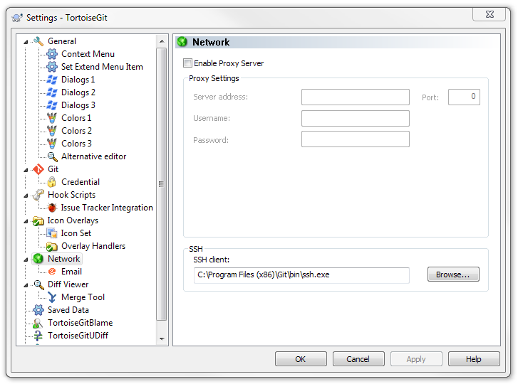

# **生成ssh key步骤**

这里以配置github的ssh key为例：

## **1. 配置git用户名和邮箱**

> git config user.name "用户名"
>
> git config user.email "邮箱"

在config后加上 --global 即可全局设置用户名和邮箱。

## **2. 生成ssh key**

> ssh-keygen -t rsa -C "邮箱"

然后根据提示连续回车即可在\~/.ssh目录下得到id\_rsa和id\_rsa.pub两个文件，id\_rsa.pub文件里存放的就是我们要使用的key。

如果生成时显示\~/.ssh目录在奇怪的位置，那想修改位置，请直接到系统设置的用户环境变量里增加%HOME%用户环境变量即可

## **3. 上传key到github**

> clip < \~/.ssh/id\_rsa.pub

1.  复制key到剪贴板

2.  登录github

3.  点击右上方的Accounting settings图标

4.  选择 SSH key

5.  点击 Add SSH key

> 也可以直接打开id\_rsa.pub文件，复制其中内容，然后粘贴到github网站中，穿件SSH Key.

## **4. 测试是否配置成功**

> ssh -T git@github.com

如果配置成功，则会显示：\
Hi username! You’ve successfully authenticated, but GitHub does not provide shell access.

有时候未必显示成功，但github访问也是没有问题的，还需要实际下载代码上传代码（使用git@github.com）测试一下

# **解决本地多个ssh key问题**

有的时候，不仅github使用ssh key，工作项目或者其他云平台可能也需要使用ssh key来认证，如果每次都覆盖了原来的id\_rsa文件，那么之前的认证就会失效。这个问题我们可以通过在\~/.ssh目录下增加config文件来解决。

下面以配置搜狐云平台的ssh key为例。

## **1. 第一步依然是配置git用户名和邮箱**

> git config user.name "用户名"
>
> git config user.email "邮箱"

## **2. 生成ssh key时同时指定保存的文件名**

> ssh-keygen -t rsa -f \~/.ssh/id\_rsa.sohu -C "email"

上面的id\_rsa.sohu就是我们指定的文件名，这时\~/.ssh目录下会多出id\_rsa.sohu和id\_rsa.sohu.pub两个文件，id\_rsa.sohu.pub里保存的就是我们要使用的key。

## **3. 新增并配置config文件**

### **添加config文件**

如果config文件不存在，先添加；存在则直接修改

> touch \~/.ssh/config

### **在config文件里添加如下内容(User表示你的用户名)**

> Host \*.cloudscape.sohu.com #对于gitlab.com,正确的配置是不能包含匹配符*的，以为 *.gitlab.com不能匹配 gitlab.com
>
> IdentityFile \~/.ssh/id\_rsa.sohu
>
> User test #此配置可省略

## **4. 上传key到云平台后台(省略)**

## **5. 测试ssh key是否配置成功**

> ssh -T git@git.cloudscape.sohu.com

成功的话会显示：

> Welcome **to** GitLab, username!

至此，本地便成功配置多个ssh key。日后如需添加，则安装上述配置生成key，并修改config文件即可。

# **设置SSH使用HTTPS的403端口**

在局域网中SSH的22端口可能会被防火墙屏蔽，可以设置SSH使用HTTPS的403端口。

测试HTTPS端口是否可用

  ---- ----------------------------------------------------------------------
  1\   \$ ssh -T -p 443 git@ssh.github.com\
  2\   Hi username! You've successfully authenticated, but GitHub does not\
  3    provide shell access.
  ---- ----------------------------------------------------------------------

编辑SSH配置文件 \~/.ssh/config 如下:

  ---- --------------------------
  1\   Host github.com\
  2\   Hostname ssh.github.com\
  3    Port 443
  ---- --------------------------

测试是否配置成功

  ---- ----------------------------------------------------------------------
  1\   \$ ssh -T git@github.com\
  2\   Hi username! You've successfully authenticated, but GitHub does not\
  3    provide shell access.
  ---- ----------------------------------------------------------------------

# **一些错误**

**disconnected no supported authentication methods available(server sent: publickey，keyboard interae）**

安装Git客户端后，进行PULL时报如下错误

disconnected no supported authentication methods available(server sent: publickey，keyboard interactive）解决方案

因为TortoiseGit和Git的冲突 我们需要把TortoiseGit设置改正如下。

1.找到TortoiseGit -&gt; Settings -&gt; Network

2.将SSH client指向\~\\Git\\bin\\ssh.exe(Git安装路径下)（Git2.7版本下在C:\\Program Files\\Git\\usr\\bin）

然后便可正确push和pull

